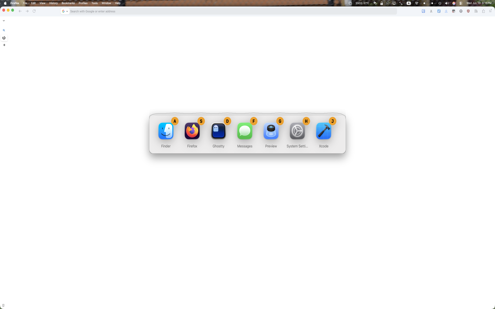

# Yo App Switcher（Yo 应用切换器）

macOS 键盘驱动应用切换器。按下快捷键呼出浮动毛玻璃面板，显示所有正在运行的 Dock 应用图标，并附带 Vimium 风格的提示键标签——按下提示键即可瞬间切换。

## 工作原理

1. 按下 **Option+a**（可自定义）打开切换面板
2. 每个运行中的应用分配一个提示键标签（A、S、D、F、G、H、J、K、L 等）
3. 按下对应提示键切换到该应用
4. 按下 **Escape** 或者再次按下快捷键关闭面板

## 功能特性

- **浮动毛玻璃面板** — 紧凑居中，不干扰工作
- **Vimium 风格提示键** — 主行按键优先，最快触达
- **可自定义快捷键** — 在偏好设置中更改
- **可调整图标大小** — 偏好设置中提供 32–128pt 滑块
- **开机自启** — 菜单栏中开启
- **冲突检测** — 快捷键与系统快捷键冲突时发出警告
- **仅菜单栏运行** — 无 Dock 图标，始终运行，轻量级
- **通用二进制** — 同时支持 Apple Silicon 和 Intel Mac

## 系统要求

- macOS 14（Sonoma）或更高版本
- **辅助功能权限**（首次启动时提示）— 应用切换所必需

## 安装方法

1. 从应用程序文件夹启动
2. 根据提示授予辅助功能权限（系统设置 → 隐私与安全性 → 辅助功能）

## 使用说明

| 操作 | 默认快捷键 |
|------|-----------|
| 打开切换面板 | Option+a |
| 切换到应用 | 按下对应的提示键 |
| 关闭面板 | Escape / 快捷键 |
| 偏好设置 | 菜单栏 → Preferences... (Cmd+,) |

## 下载链接   

https://apps.apple.com/us/app/yoappswitcher/id6778926070?mt=12

## 版本历史

**0.2** — 初始版本
